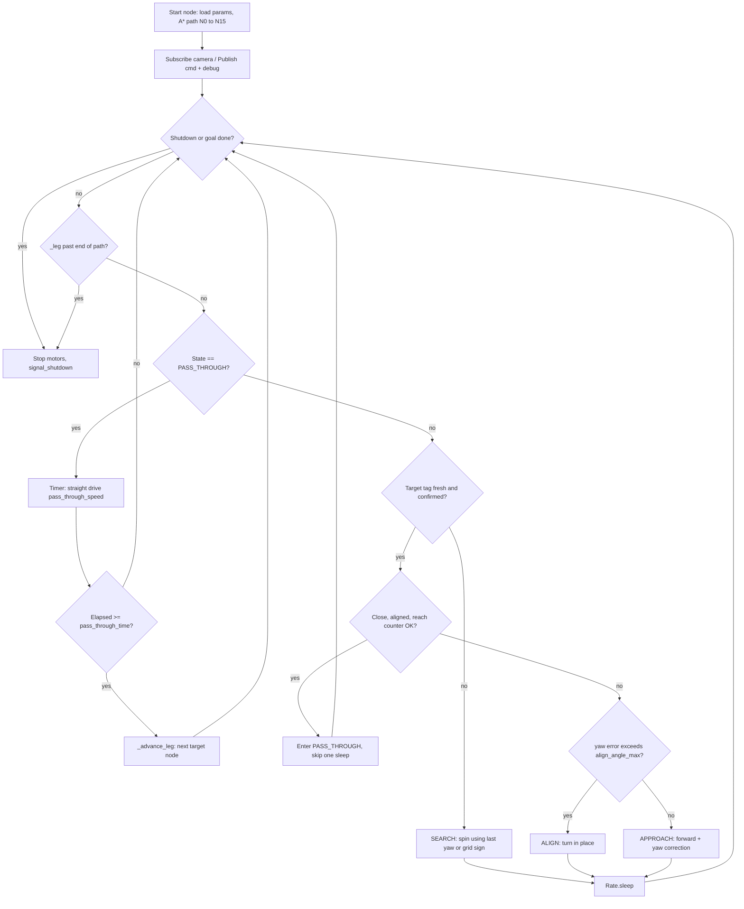
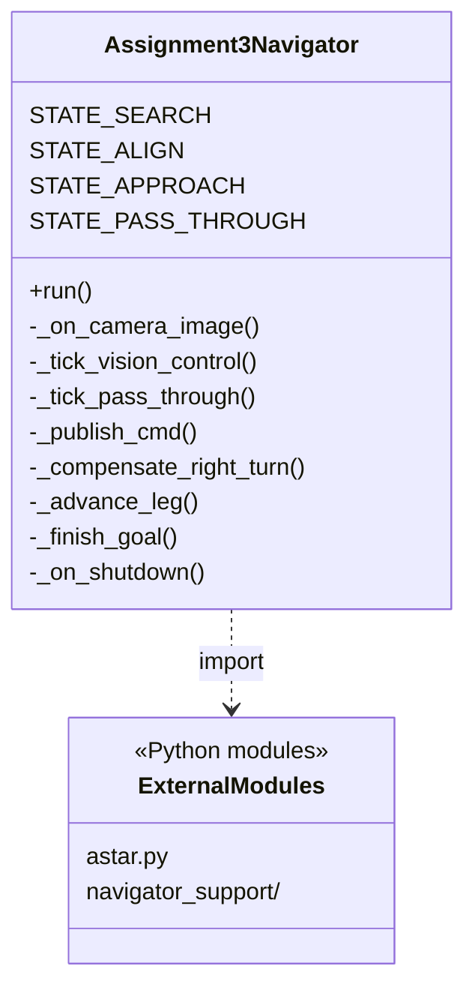

# PA3-Robotic (Duckietown Assignment 3)

## Overview

This workspace runs **Assignment 3** on a Duckiebot: plan a path on the course grid with `A*` search, then drive **node to node** using **ArUco tags** seen in the onboard camera. There is **no global localization**; the navigator only knows which tag IDs exist in view and estimates range and bearing from the camera pose of each marker.

High-level pipeline:

1. **`astar.py`** — Offline graph search from **N0** to **N15** (grid and edge costs from the assignment).
2. **`navigator_node.py`** — ROS node: decode camera images, detect ArUco, estimate tag pose, run a small **state machine** per path leg, publish **`Twist2DStamped`** to the Duckietown car command topic.
3. **`navigator_support/`** — Default parameters, geometry helpers, OpenCV ArUco wrappers, and grid-based turn hints for the SEARCH state.
4. **`aruco_viewer.py`** (optional) — Remote viewer: subscribe to the robot camera, draw detections in an OpenCV window.

---

## Repository layout

```text
PA3-Robotic/
├── README.md
├── view_aruco.sh
└── assignment3/
    ├── Dockerfile
    ├── dt-project.yaml
    ├── configurations.yaml
    ├── dependencies-apt.txt
    ├── dependencies-py3.txt
    ├── dependencies-py3.dt.txt
    ├── launchers/
    │   └── default.sh
    └── packages/
        └── assignment3/
            ├── CMakeLists.txt
            ├── package.xml
            ├── launch/
            │   ├── assignment3.launch
            │   └── aruco_viewer.launch
            └── src/
                ├── astar.py
                ├── navigator_node.py
                ├── aruco_viewer.py
                └── navigator_support/
                    ├── __init__.py
                    ├── defaults.py          # default ~param values
                    ├── geometry.py          # norm3, bearing_to_tag
                    ├── aruco_cv.py          # OpenCV ArUco API compatibility
                    ├── path_geometry.py     # SEARCH spin direction from A* polyline
                    └── debug_overlay.py     # optional text overlay on frames
```

---

## How the navigator behaves

### Path and “legs”

- At startup the node runs **`astar_search(0, 15)`** and stores an ordered list of node IDs, e.g. `N0 → N1 → … → N15`.
- Index **`_leg`** points at the **current target node ID** (the ArUco ID you must face and approach). The robot tries to reach **`path[_leg]`** before incrementing `_leg`.

### Async camera vs control loop

- **`_on_camera_image`** (callback) decodes JPEG, resizes, runs ArUco detection, **`estimatePoseSingleMarkers`**, and updates dictionaries of latest **distance**, **yaw error**, and **debounce counters** (`CONFIRM_FRAMES`, `REACH_CONFIRM_FRAMES`).
- **`run()`** runs at **`rospy.Rate(20)`**: it reads those cached measurements and publishes velocity commands. The callback does **not** drive the motors directly.

### Control states (per leg)

| State | When | Command idea |
|--------|------|----------------|
| **SEARCH** | Target tag missing or measurement “stale” / not enough confirm frames | Spin in place; turn sign from last yaw error if known, else from **`compute_search_turn_sign`** on the grid |
| **ALIGN** | Tag visible, confirmed, but **\|yaw error\|** large | Turn in place (P-gain × yaw, clamped by **`min_turn_omega`**) |
| **APPROACH** | Tag visible and **\|yaw error\|** below **`align_angle_max`** | Forward speed + proportional yaw correction |
| **PASS_THROUGH** | Close enough, **`REACH_CONFIRM_FRAMES`** satisfied, yaw within **`pass_through_align_threshold`** | Drive straight **`pass_through_speed`** for **`pass_through_time`**, then **`_advance_leg`** |

Right turns can be scaled with **`right_turn_omega_scale`** / **`search_right_scale`** if one wheel is weaker.

---

## Main code pieces (quick reference)

### `astar.py`

| Symbol | Role |
|--------|------|
| `COORDINATES` | `(x, y)` for each node **N0..N15** |
| `GRAPH` | Adjacency list with edge costs |
| `euclidean_heuristic` | `h(n)` for A* |
| `astar_search(start, goal)` | Returns path list and total cost, or `(None, nan)` |
| `format_path` | Pretty string `N0 -> N1 -> …` |

### `navigator_support/defaults.py`

Central place for **default ROS private parameters** (overridden from **`assignment3.launch`** or the parameter server). Includes speeds, thresholds, camera intrinsics, distortion, ArUco physical size, and debounce frame counts.

### `navigator_support/geometry.py`

| Function | Role |
|----------|------|
| `norm3(x, y, z)` | Range to tag from translation vector |
| `bearing_to_tag(tx, ty, tz)` | Yaw error in camera frame: `atan2(-tx, tz)` |

### `navigator_support/path_geometry.py`

| Function | Role |
|----------|------|
| `compute_search_turn_sign(path, leg_idx)` | Uses 2D cross product of incoming/outgoing grid segments to guess **left (+1)** vs **right (-1)** spin while searching |

### `navigator_support/aruco_cv.py`

Wraps differences between OpenCV 4.x (`ArucoDetector`, `DetectorParameters`) and older APIs (`detectMarkers`, `DetectorParameters_create`).

### `navigator_node.py`

| Method | Role |
|--------|------|
| `__init__` | Load params, build camera matrix, run A*, subscribe/publish |
| `_on_camera_image` | Image decode, ArUco, pose, buffers |
| `_tick_vision_control` | SEARCH / ALIGN / APPROACH / transition to PASS_THROUGH |
| `_tick_pass_through` | Timed straight segment, then next leg |
| `_publish_cmd` | `Twist2DStamped` with clamped **omega** |
| `_compensate_right_turn` | Scale negative **omega** |
| `_advance_leg` | Clear buffers, increment `_leg`, recompute search sign |
| `run` | Main loop |

---

## Flow diagram (navigator)



---

## Class diagram (navigator and helpers)

The running ROS process is centered on one main class. Path planning and helpers are plain Python modules (`astar.py`, `navigator_support/*.py`), not classes.



---

## Robot name

If your vehicle is not **`bear`**, set it consistently:

1. **`assignment3/launch/assignment3.launch`** — `veh` argument / `VEHICLE_NAME`.
2. **`assignment3/launchers/default.sh`** — `VEHICLE_NAME` or `VEH`.
3. **`navigator_support/defaults.py`** — `ROBOT_NAME_DEFAULT` (fallback only).

Topics are built as `/<robot_name>/camera_node/image/compressed` and `/<robot_name>/car_cmd_switch_node/cmd` unless overridden with `~camera_image_topic` / `~cmd_topic`.

---

## Build

```bash
dts devel build -f --arch arm32v7 -H ROBOTNAME.local
```

Use your Duckiebot hostname instead of **`ROBOTNAME`**.

---

## Run

```bash
dts devel run -H ROBOTNAME.local
```

---

## Launch navigator only

```bash
roslaunch assignment3 assignment3.launch veh:=bear
```

Adjust parameters inside **`assignment3.launch`** as needed (gains, thresholds, ArUco dictionary string, etc.).

---

## ArUco viewer (on your laptop)

```bash
export ROS_MASTER_URI=http://bear.local:11311
export ROS_HOSTNAME=$(hostname).local

./view_aruco.sh            # default robot bear
./view_aruco.sh autobot01
DEBUG=1 ./view_aruco.sh    # also show navigator debug_image topic
```

Or:

```bash
roslaunch assignment3 aruco_viewer.launch veh:=bear
```

Close the window with **`q`** or **`ESC`**.

**Dependencies on the PC:** ROS (Noetic/Melodic) sourced, Python 3, `opencv-contrib-python`, `numpy`, `duckietown_msgs`, `sensor_msgs`.

---

## Expected console output (illustrative)

```text
A* path: N0 -> N1 -> N2 -> ...
Node N1 passed. Next leg.
...
Goal Reached
```

---

## Troubleshooting

### Robot spins forever / never locks onto the tag

- Check the camera topic matches **`~camera_image_topic`** (default: `/<veh>/camera_node/image/compressed`).
- Verify **`~aruco_dictionary`** matches printed tags (e.g. `DICT_5X5_50`).
- Tune **`~aruco_tag_size_meters`**, camera intrinsics, and distortion in **`navigator_support/defaults.py`** or via parameters.
- Increase **`~detection_stale_sec`** or adjust **`CONFIRM_FRAMES`** / **`REACH_CONFIRM_FRAMES`** in defaults if detections flicker.

### No motion or weak turns

- Raise **`~min_turn_omega`** and/or **`~search_angular_speed`**.
- Adjust **`~right_turn_omega_scale`** / **`~search_right_scale`** for asymmetric motors.

### Wrong robot name

- Commands go to **`/<wrong_name>/...`** topics. Align **`veh`** / **`VEHICLE_NAME`** everywhere (launch + shell).

---

## Notes

- Ensure ROS networking (`ROS_MASTER_URI`, `ROS_HOSTNAME`) is correct when running tools off-board.
- The navigator uses **ArUco pose from the camera**, not a separate AprilTag ROS detection topic, unless you change the code to consume one.
